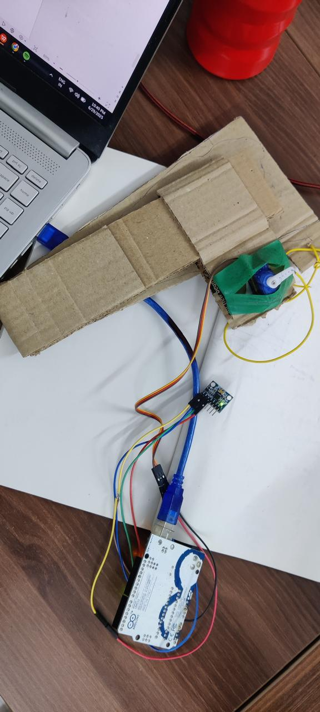

# Neurolift – IoT-Based Smart Foot Drop Rehabilitation System



**Version:** 1.0  
**Authors:** P Abhinaya Gayatri Reddy (First Year, Second Semester), N. V. Dheeraj, Avaneesh  
**Date:** 2025  
**License:** MIT  
**Status:** Student Project / Educational Prototype

---

## Project Overview

Neurolift is a **wearable IoT-based rehabilitation prototype** designed to assist people affected by **foot drop** — a condition where the patient experiences difficulty lifting the front part of the foot during walking.

This system uses:
- **MPU6050 accelerometer/gyroscope** to detect foot movement
- **EMG muscle sensor** to sense muscle activity
- **Arduino Uno microcontroller** for real-time processing
- **SG90 servo motor** to provide mechanical assistance

**WARNING:** This is a student-level proof-of-concept prototype, NOT a medical device. It is designed for educational purposes and demonstration only.

---

## Problem Statement

### What is Foot Drop?

Foot drop is a neurological condition where a person **cannot lift the front part of their foot** (dorsiflexion) while walking, causing:
- **Toe dragging** on the ground
- **Increased tripping** and fall risk
- **Altered gait patterns**
- **Reduced mobility** and confidence
- **Higher energy expenditure**

**Common Causes:**
- Nerve injuries or damage
- Stroke or traumatic brain injury
- Spinal cord injury
- Neurological disorders (MS, Parkinson's, etc.)
- Muscle weakness or paralysis

### Current Treatment Limitations

Existing rehabilitation systems can be expensive and inaccessible for many users. They are often bulky, uncomfortable for extended wear, and difficult to customize for individual needs.

---

## Solution: Neurolift

Neurolift is a student-built prototype that explores the use of embedded systems and wearable technology in rehabilitation applications:

* Real-time foot drop detection using accelerometer data
* Adaptive mechanical assistance based on walking speed and muscle activity
* Affordable prototype built with readily available components
* Educational platform for learning embedded systems and sensor integration
* Fully documented code and hardware for learning and customization

---

## Hardware Components

This prototype uses affordable and easily available components suitable for student-level prototyping and experimentation:

- **Arduino Uno** - Microcontroller for real-time sensor processing
- **MPU6050** - Accelerometer/gyroscope for detecting foot angle and movement
- **EMG Sensor** - Surface electrode sensor for muscle activity detection
- **SG90 Servo Motor** - Actuator for mechanical foot lift assistance
- **Supporting Components** - Jumper wires, USB power supply, ankle brace structure (cardboard/3D-printed), mechanical linkage (string/fishing line)

For detailed specifications, see [hardware/components.md](hardware/components.md)

---

## System Architecture

```
┌─────────────────────────────────────────────────────────┐
│            NEUROLIFT SYSTEM ARCHITECTURE                │
└─────────────────────────────────────────────────────────┘

    SENSOR LAYER              PROCESSING LAYER         ACTUATION LAYER
    ────────────              ────────────────         ───────────────
    
    MPU6050                   Arduino Uno             SG90 Servo
    (Foot angle)     ──I2C──  (Logic &                Motor
                              Processing)  ──PWM──   (Lifting)
    
    EMG Sensor               Signal                   Mechanical
    (Muscle)       ──A0──   Analysis &               Linkage
                             Decision                 
                             Making                   Ankle Brace
                                                      (Output)
```

### Key System Features:

1. **Real-Time Detection**
   - Foot angle calculation from accelerometer
   - Muscle activity monitoring
   - Walking speed estimation from step intervals

2. **Intelligent Assistance**
   - Adaptive servo control based on walking speed
   - EMG-triggered support
   - Multiple support levels (light/medium/high)

For detailed architecture, see [docs/architecture.md](docs/architecture.md)

---

## How It Works

1. **MPU6050 detects foot angle** - Measures acceleration to determine if foot is drooping
2. **EMG sensor detects muscle activity** - Senses electrical signals from tibialis anterior muscle
3. **Arduino processes sensor data** - Reads both sensors every 100ms and compares against thresholds
4. **Servo activates when abnormal movement is detected** - When foot angle exceeds 45°, servo moves to assist
5. **Mechanical linkage lifts the foot** - String connected to ankle brace pulls foot upward to prevent toe dragging

For detailed workflow, see [docs/workflow.md](docs/workflow.md)

---

## Project Structure

```
Neurolift/
│
├── firmware/
│   └── neurolift.ino                 # Main Arduino code
│
├── hardware/
│   ├── circuit-diagram.png           # Wiring schematic
│   ├── wiring-guide.md               # Detailed connection guide
│   └── components.md                 # Component specifications
│
├── docs/
│   ├── problem-statement.md          # Problem & solution overview
│   ├── workflow.md                   # Detailed gait cycle workflow
│   ├── architecture.md               # System architecture & design
│   └── future-scope.md               # Future enhancements & roadmap
│
├── media/
│   ├── prototype-overview.jpg        # System overview image
│   ├── wearable-setup.jpg            # Wearing the brace image
│   ├── electronics-setup.jpg         # Electronics assembly image
│   └── demo-video.mp4                # Demonstration video (optional)
│
├── README.md                         # This file
├── LICENSE                           # MIT License
└── .gitignore                        # Git ignore rules
```

---

## Installation & Setup

### Requirements

- Arduino IDE (https://www.arduino.cc/en/software)
- Arduino Uno with USB cable
- All hardware components ([hardware/components.md](hardware/components.md))
- Required libraries: MPU6050, Servo, Wire

### Wiring & Configuration

- MPU6050: SDA→A4, SCL→A5, VCC→5V, GND→GND
- EMG Sensor: OUT→A0, VCC→5V, GND→GND
- Servo Motor: Signal→Pin9, Power→5V, Ground→GND

See [hardware/wiring-guide.md](hardware/wiring-guide.md) for complete details.

---

## Serial Monitor Output

```
Neurolift System Initialized
MPU6050 connected successfully!
System ready. Starting foot drop detection...

Foot Angle: 12.34° | EMG Value: 85 | Walking Speed: 0.75 m/s
Foot Angle: 48.92° | EMG Value: 195 | Walking Speed: 0.75 m/s
Normal walking detected - Low support activated
Foot Angle: 62.15° | EMG Value: 240 | Walking Speed: 0.75 m/s
STRONG muscle activity detected! Maximum support activated
Foot Angle: 28.50° | EMG Value: 120 | Walking Speed: 0.75 m/s
```

---

## Technical Details

### Sensor Data Processing

```
1. Raw Sensor Input
   ├─ MPU6050 acceleration (ax, ay, az)
   └─ EMG analog reading (0-1023)

2. Data Filtering & Conversion
   ├─ Calculate foot angle: atan2(ay, az) × 180/π
   └─ Normalize EMG to 0-1023 range

3. Threshold Comparison
   ├─ Foot drop detection: angle > 45°
   └─ Muscle activity: EMG > 200

4. Walking Speed Estimation
   ├─ Detect step: ay > 15000
   ├─ Calculate: stepInterval (milliseconds)
   └─ Speed = 0.75m / (stepInterval/1000)

5. Decision Making
   ├─ Determine servo position based on:
   │  ├─ Foot drop status
   │  ├─ Walking speed
   │  └─ Muscle activity
   │
   └─ Output: PWM signal to servo

6. Servo Activation
   └─ Motor moves to target position (0-180°)
```

### Motor Control

## Learning Outcomes

- Embedded systems programming (Arduino)
- Sensor integration and signal processing
- Wearable device design
- Real-time data processing
- Rehabilitation engineering basics

---

## Media & Documentation

1. **prototype-overview.jpg** - Wearable ankle brace prototype
2. **wearable-setup.jpg** - Mechanical ankle support structure
3. **electronics-setup.jpg** - Arduino and sensor connections
4. **demo-video.mp4** - Working demonstration

---

## Additional Documentation

- **[Problem Statement](docs/problem-statement.md)** - Detailed problem analysis and solution approach
- **[System Architecture](docs/architecture.md)** - Complete technical architecture and design
- **[Workflow Documentation](docs/workflow.md)** - Detailed gait cycle and signal processing
- **[Hardware Components](hardware/components.md)** - Component specifications and sourcing
- **[Wiring Guide](hardware/wiring-guide.md)** - Complete connection instructions
- **[Future Scope](docs/future-scope.md)** - Enhancement roadmap and research opportunities

---

## Limitations & Disclaimer

### Important Notes

**This is a PROTOTYPE ONLY**
- NOT FDA-approved or medically certified
- NOT for use as a medical device
- NOT for clinical rehabilitation without professional supervision
- Educational and research purposes only

### System Limitations

- Single-foot operation (future: bilateral)
- Requires stable network of sensors
- Manual calibration required per user

### Safety Requirements

- Supervision required when testing on users
- Clear walking space needed (no obstacles)
- Remove system if skin irritation occurs
- Not suitable for medical emergency use
- Healthcare professional consultation recommended

---

## License

This project is licensed under the **MIT License** - see [LICENSE](LICENSE) file for details.

**In summary:** You can use, modify, and distribute this code freely, as long as you include the license notice.

---

## Conclusion

Neurolift provides a practical foundation for understanding:
- Embedded systems and IoT in healthcare applications
- Rehabilitation engineering principles
- Wearable technology development
- Real-time sensor processing and control systems

This project demonstrates how accessible technology can address real-world problems through thoughtful engineering and iteration.

---

**Last Updated:** 2025
**Authors:** P Abhinaya Gayatri Reddy (First Year, Second Semester), N. V. Dheeraj, Avaneesh
